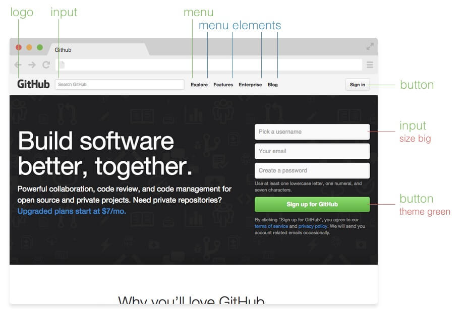

# Introduction

On smaller brochure sites, how you organize your styles isn’t usually a big concern. You get in there, write some CSS, or maybe even some SASS. You compile it all into a single stylesheet with SASS’s production settings, and then you aggregate it to get all the stylesheets from modules into a nice tidy package.

However, when it comes to larger, more complex projects, how you organize your code is a key to efficiency. Not only in how much time it takes, but also in how much code you write, and how much a browser has to load. This is especially important when you’re working with a team of themers, and when performance is important.

This also true for long-term projects with legacy code (read "[How to Scale and Maintain Legacy CSS with Sass and SMACSS](http://webuild.envato.com/blog/how-to-scale-and-maintain-legacy-css-with-sass-and-smacss/)" — some nice SMACSS and BEM mixing in there).


## Methodologies

There are plenty of [methodologies](https://github.com/ikkou/awesome-css#architecture) out there which aimed on reducing CSS codebase and organizing programmers cooperation and maintaining of CSS code. This is obvious in large projects like Twitter, Facebook and [Github](http://markdotto.com/2014/07/23/githubs-css/#two-bundles), but other projects often grows into same “Huge CSS file” state pretty quickly.

#### [OOCSS](https://oocss.org/)

Separating container and content with CSS “objects”

#### [SMACSS](https://smacss.com/)

Style-guide to write your CSS with five categories for CSS rules

#### [SUITCSS](http://suitcss.github.io/)

Structured class names and meaningful hyphens

#### [Atomic CSS](https://github.com/nemophrost/atomic-css)

Breaking down styles into atomic, or indivisible, pieces

> We are looking for authors to write proper "[Comparison of methodologies](https://github.com/getbem/getbem.com/issues/11)"


## Why BEM over the others?

No matter what methodology you choose to use in your projects, you will get advantages of structured CSS and UI. Some of them are less strict and more flexible, other is easier to understand and adapt in team. Instead of writing our opinion on BEM advantages, we leave you with some quotes about it:

<blockquote>
	<p>The reason I choose BEM over other methodologies comes down to this: it's less confusing than the other methods (i.e. SMACSS) but still provides us the good architecture we want (i.e. OOCSS) and with a recognizable terminology.</p>
	<footer>Mark McDonnell, <a href="http://www.integralist.co.uk/posts/maintainable-css-with-bem/#why-bem-over-the-others">Maintainable CSS with BEM</a></footer>
</blockquote>


## Blocks, Elements and Modifiers

You will not be surprised, that BEM is abbreviation of the key elements of the methodology — Block, Element and Modifier. Strict rules of naming can be found in [Naming](/naming) article.

#### Block

Standalone entity that is meaningful on its own.

__Examples__

`header`, `container`, `menu`, `checkbox`, `input`

#### Element

Parts of a block and have no standalone meaning. They are semantically tied to its block.

__Examples__

`menu item`, `list item`, `checkbox caption`, `header title`

#### Modifier

Flags on blocks or elements. Use them to change appearance or behavior.

__Examples__

`disabled`, `highlighted`, `checked`, `fixed`, `size big`, `color yellow`



## Under the hood

Lets look how one particular element on page can be implemented in BEM. We will take `button` from [GitHub styleguide](https://github.com/styleguide/css/1.0):


We can have normal button for usual cases, and two more states for different ones. Because of BEM style blocks by class selectors, we can implement blocks with any tags we want (`button`, `a` or even `div`). Naming invites us to use `block--modifier--value` syntax.

### HTML

```html
<button class="button">
  Normal button
</button>

<button class="button button--state-success">
  Success button
</button>

<button class="button button--state-danger">
  Danger button
</button>
```

### CSS

```css
.button {
  display: inline-block;
  border-radius: 3px;
  padding: 7px 12px;
  border: 1px solid #D5D5D5;
  background-image: linear-gradient(#EEE, #DDD);
  font: 700 13px/18px Helvetica, arial;
}

.button--state-success {
  color: #FFF;
  background: #569E3D linear-gradient(#79D858, #569E3D) repeat-x;
  border-color: #4A993E;
}

.button--state-danger {
  color: #900;
}
```


## Further Reading

For more examples of building BEM blocks you can read "[Building My Health Skills — Part 3](http://www.bluegg.co.uk/building-my-health-skills-part-3/)" by Hamish Taplin.


## Benefits

### Modularity

Blocks styles should not have dependencies on other elements on a page, therefore you will never get [problems from cascading](http://www.phase2technology.com/blog/used-and-abused-css-inheritance-and-our-misuse-of-the-cascade/).

This also gives you ability to transfer blocks from ready project to new one.

### Reusability

Composing independent blocks in a different way and reusing them reduces amount of CSS code, that you will maintain.

If you have design guidelines, then it is super effective to have ready Blocks library.

### Structure

BEM methodology gives you simple and understandable structure in your CSS code.


## Case study

We are looking forward to writing "How to migrate existing project to BEM". In meanwhile you can watch nice presentation by Nicole Sullivan — "[CSS preprocessor performance](http://www.youtube.com/watch?v=0NDyopLKE1w)". It gives a very good explanation of problems, that she meets in major of sites and ways to track and handle them.
